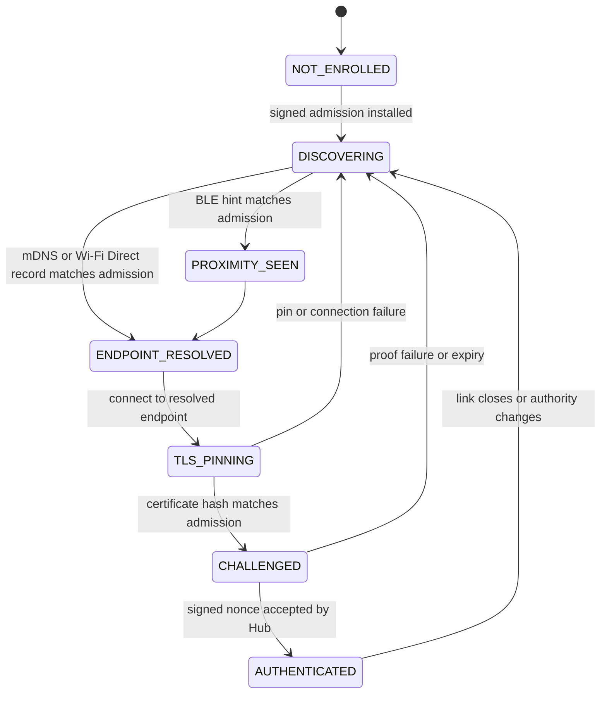

# ADR-005: Terminal Local-Link Runtime and Release Gates

- **Status:** Accepted for source implementation; physical evidence pending
- **Date:** 26 August 2026
- **Decision owner:** ThePlugOS product owner
- **Depends on:** ADR-003, ADR-004, and `NATIVE_HUB_ENROLLMENT_AND_SYNC_PROTOCOL.md`

## Context

ADR-004 introduced cloud-issued terminal admissions, Hub mDNS advertisement,
and a Bluetooth proximity beacon.  That foundation did not give an enrolled
terminal a native resolver, a certificate-pinned TLS client, or a measured
local-link status.  It also left the native `hub-terminal-enrollment` endpoint
out of the Supabase function configuration, where default JWT enforcement
would reject the device proof flow.

The project cannot use a staging clone, an acceptance environment, or physical
radio hardware in this delivery.  The source must therefore be complete and
fail closed, while the release status remains HOLD until those facts can be
measured outside this workspace.

## Decision

### 1. A terminal has an explicit, measured local-link state machine

Only the signed terminal admission supplies `hubDeviceId`, the Hub TLS
fingerprint, and allowed transports.  mDNS attributes, Wi-Fi Direct service
records, Bluetooth packets, IP addresses, and device names are discovery hints
only.  A terminal reports a connection as authenticated only after all of the
following happen on the native device:

1. its locally stored admission verifies against a release-pinned issuer key;
2. a LAN mDNS or Wi-Fi Direct discovery record names the admitted Hub and
   certificate fingerprint;
3. the TLS peer certificate hashes to that same fingerprint; and
4. the Hub accepts a signature over its fresh local challenge.

Bluetooth LE remains non-connectable proximity assistance.  It carries a
versioned opaque hash only and cannot pair a device, carry a command, or
replace certificate pinning.  Wi-Fi Direct is an alternate IP path to the
same TLS and challenge protocol; it never grants authority based on an SSID,
peer MAC address, or Android peer name.

### 2. Link readiness is not operational command authority

R010 establishes terminal admission and authenticated transport readiness. It
does not itself turn a device into an operator. ADR-010 is the subsequent,
separate operational-terminal decision: a paired terminal may obtain a
cloud-issued native staff session only after its Keystore proof and a fresh
native PIN check, then install that signed assertion over this authenticated
link. The Hub still verifies device, role, expiry, sequence, and revocation
before it commits an operational command.

No browser UI, BLE packet, or generic local-link client may invent a staff
session, command sequence, or command signature. A terminal that is merely
`AUTHENTICATED` remains command-ineligible until ADR-010's
`STAFF_SESSION_ACTIVE` state is measured. This prevents a misleading
"connected" status from becoming unauthorised Cashier, Kitchen, or Manager
authority.

### 3. Edge Function exposure is least privilege

`hub-enrollment`, `hub-staff-session`, `hub-sync`, and
`hub-terminal-enrollment` are native proof endpoints.  Supabase JWT
verification is disabled only for those endpoints because each performs its
own request, rate-limit, proof, scope, and service-RPC validation.  The
owner-facing enrollment endpoint continues to require a Supabase user JWT and
an exact configured portal origin.

### 4. Admissions renew with proof of the original terminal key

An active terminal may renew its signed admission with a separate short-lived
challenge. The cloud rate-limits the device hash, verifies that the terminal is
still active and its public key is unchanged, then verifies an ECDSA signature
over `theplugos.terminal-renewal.v1`. Renewal replaces the signed admission in
an audited transaction but does not change the branch authority revision,
terminal role, or Hub selection. A revoked device, changed key, expired
renewal challenge, or absent active Hub fails closed.

### 5. Deployment is deliberately fail closed

The release helper may set Edge Function secrets, push migrations, and deploy
the fixed Hub authority Function set only after all of these source-controlled
conditions are true:

- `docs/operations/RELEASE_STATUS.md` declares `Status: APPROVED`;
- the caller supplies an explicit environment, expected project reference, and
  one-time confirmation that includes both; and
- the secure deployment environment supplies the required issuer and rate-limit
  secrets without writing them to source control.

While release status is HOLD, the helper performs no remote mutation.  This
is a deployment safeguard, not a substitute for the required staging,
hardware, rollback, backup/restore, and pilot evidence.

## Failure handling

| Condition | Required terminal behavior |
| --- | --- |
| Missing or invalid admission | Clear/reject the admission; do not discover or connect. |
| Expired but otherwise verified admission | Do not discover or connect. Retain it only in Keystore-wrapped storage long enough to prove the existing key during cloud renewal. |
| BLE unavailable | Continue LAN/Wi-Fi Direct discovery; report BLE unavailable. |
| Discovery mismatch | Ignore the record and continue searching; never show it as the Hub. |
| TLS pin mismatch | Close the socket; do not fall back to normal CA trust or cleartext. |
| Challenge failure/expiry | Close the socket and return to discovery. |
| Hub renewal/revocation changes authority | Drop the connection and require a newly matching admission/link. |
| Missing runtime permission | Report unavailable; do not infer permission or radio availability. |

## Verification strategy

`scripts/test-r014-device-pairing-local-links-contract.mjs` must verify the
cloud configuration, migration boundaries, native enrollment flow, discovery
filters, TLS pinning, challenge proof, release guard, and owner-only browser
control.  The existing TypeScript, Android-host static, and release-truth
checks remain required.

This source verification cannot prove Android radio behavior, Supabase
deployment, data migration, or a physical TLS handshake.  Those remain
explicit release evidence, not an inferred pass condition.
