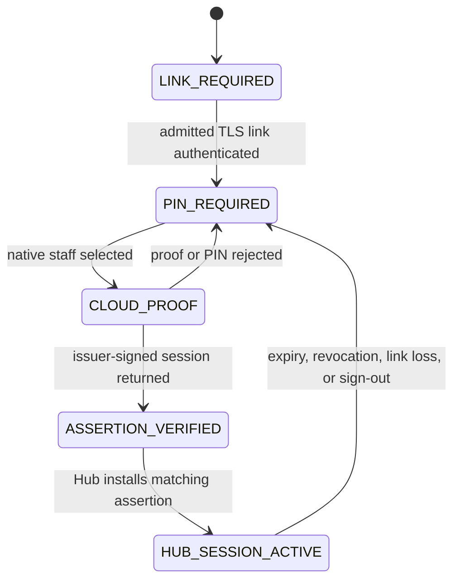

# ADR-010: Native Terminal Staff Session and Command Authority

- **Status:** Accepted for source implementation; cloud deployment and physical evidence pending
- **Date:** 27 August 2026
- **Decision owner:** ThePlugOS product owner
- **Depends on:** ADR-003, ADR-004, ADR-005, `LOCAL_FIRST_OPERATIONAL_COMMAND_CONTRACT.md`, and `NATIVE_HUB_ENROLLMENT_AND_SYNC_PROTOCOL.md`

## Context

R010/R011 make a terminal discoverable and mutually authenticated with the
Cashier Hub, but correctly stop at link readiness.  An authenticated TCP/TLS
peer is not an operator: it has neither a fresh staff PIN verification nor a
role-bound command session.  Leaving that boundary implicit would let a future
terminal screen turn a connection badge into Cashier, Kitchen, or Manager
authority.

The existing Hub command verifier already requires a signed command, a paired
device, an expiry-bound staff session, a matching branch revocation version,
and a role permission.  This decision adds the missing native-only path that
creates and installs those terminal-bound staff sessions.  It deliberately
reuses the Hub's issuer and durable session model rather than creating a second
browser or BLE authority system.

## Decision

### 1. A terminal session is bound to both the active Hub and its command device

Cloud records a terminal session as a `hub_staff_sessions` row associated with
the active Cashier Hub for cloud replication, with an explicit
`command_device_id` referring to the enrolled terminal.  That preserves the
existing immutable event and financial foreign-key model while making the
terminal—not the Hub—be the only device that can sign commands for that
session.

For cloud replication, the event envelope's `deviceId` remains the active Hub
delivery authority. The terminal origin is preserved through the immutable
`staffSessionId` → `command_device_id` relation rather than by allowing a
terminal to impersonate the Hub's signed sync request. The local ledger and
receipt retain the terminal device ID for operator-facing audit.

Only `CASHIER`, `KITCHEN_STAFF`, and `MANAGER` roles can receive a terminal
session.  The staff role must equal the enrolled terminal role.  Owner and
Administrator roles remain browser/control-plane roles and never receive an
operational terminal session.

### 2. Staff PIN verification is native, online, and proof-bound

The terminal requires a current signed admission and an authenticated pinned
TLS link before it presents the native staff sign-in surface.  It calls the
service-only `hub-terminal-staff-session` receiver with its non-exportable
Android Keystore public key and a request ID.  The receiver verifies all of:

1. the terminal is active, admitted, branch-scoped, and still bound to its
   original signing key;
2. its Hub is the branch's active Hub and its admission/revocation version is
   current;
3. the selected staff member is active in that branch and matches the terminal
   operational role; and
4. the terminal signs a fresh server nonce and the staff PIN passes the
   service-only credential verifier.

The exact proof bytes are line-delimited UTF-8, with LF separators and no
trailing newline:

```text
theplugos.terminal-staff-session.v1
{requestId}
{challengeId}
{nonceBase64url}
{terminalDeviceId}
{hubDeviceId}
{staffId}
```

PIN values, PIN hashes, challenge secrets, private keys, and reset codes never
enter a browser bridge, terminal event, audit payload, or local-link message.

### 3. The cloud issues a compact signed session assertion

After server-side PIN verification, the receiver signs a compact
`TerminalStaffSessionAssertionV1`.  It carries only the session ID, staff ID,
business/branch, active Hub ID, terminal ID and public key, role, issue/expiry
times, and branch revocation version.  It is not a bearer token: commands
still require the enrolled terminal's Keystore signature and a successful TLS
challenge on the admitted Hub.

The terminal verifies the assertion with the release-pinned issuer-key map,
stores it encrypted with its durable command sequence, and sends the exact
signed envelope over the already authenticated local TLS link in a
`STAFF_SESSION` message.  The Hub independently verifies the same issuer
signature and all current bundle bindings before atomically installing the
local session.  A signed assertion for another Hub, branch, terminal key,
terminal role, or revocation version is rejected without changing the ledger.

### 4. Local command readiness is explicit



`HUB_SESSION_ACTIVE` is the only state in which the terminal command client may
allocate a sequence and sign an operational command.  The client persists the
next sequence in Keystore-wrapped storage before transmission, retains the
same command ID/bytes for a retry, and treats `APPLIED`, `DUPLICATE`,
`REJECTED`, and `UNAVAILABLE` as distinct measured outcomes.

### 5. Renewal and revocation remain one authority chain

Terminal sessions expire no later than the Hub bundle from which their branch
authority is derived.  A Hub bundle refresh includes every active terminal
session so a restart or reconciliation cannot silently resurrect or discard a
different authority set.  A new sign-in for the same terminal revokes its
prior terminal session in the cloud and replaces it locally only after the
new signed assertion is installed.  A device or branch revocation changes the
bundle version; the Hub then rejects the old session before a new command can
reach the atomic ledger.

## Failure handling

| Condition | Required behavior |
| --- | --- |
| No valid admission or authenticated link | Do not display a PIN entry surface or create a session. |
| PIN failure or lockout | Return a generic native failure; record the existing bounded audit/rate-limit fact; create no session. |
| Cloud unavailable | Do not start or renew a terminal staff session. A previously installed, unexpired session may continue only through its existing Hub checks. |
| Assertion signature/binding mismatch | Clear the pending terminal session candidate; send nothing to the Hub. |
| Hub rejects `STAFF_SESSION` | Do not allocate a command sequence or submit commands; retain no active local session. |
| Reused command ID | Retry exactly the same signed bytes; never allocate a replacement sequence for it. |
| Link loss after local commit | Preserve the terminal-visible receipt state and let the Hub's durable outbox govern cloud delivery. |

## Verification strategy

The dedicated R017 contract gate must prove the ordered R014 schema applies to
the R001A–R013 chain, public roles cannot read or execute terminal-session
controls, the Edge receiver has no browser CORS surface, role/device/Hub
bindings are explicit, and the Android transport accepts `STAFF_SESSION` only
after `HELLO` succeeds.  Android-host/static checks additionally prove that no
Capacitor method exposes terminal PINs, assertion installation, or generic
command payloads.

This source gate does not prove a deployed secret store, actual Edge Function
execution, Android Keystore behavior, radio transport, backup/restore, or
multi-device recovery.  Those remain release evidence and keep the project on
HOLD.
